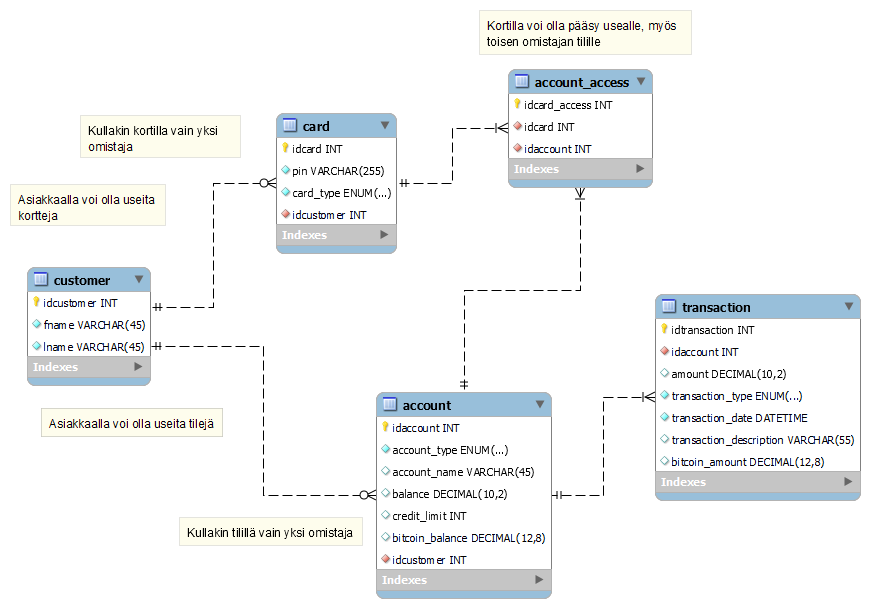
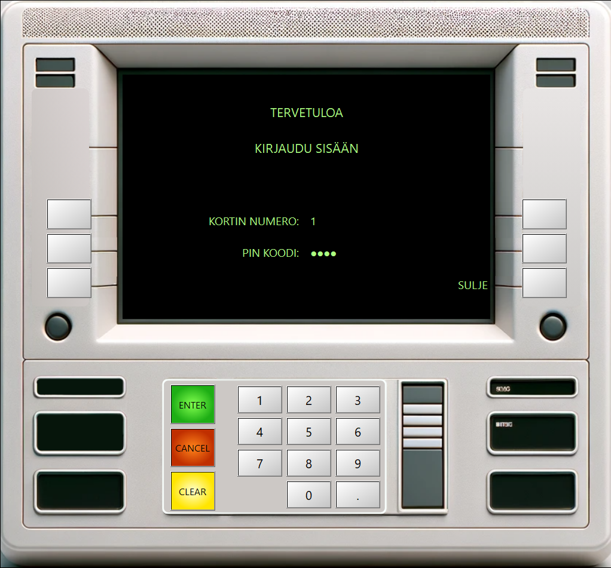
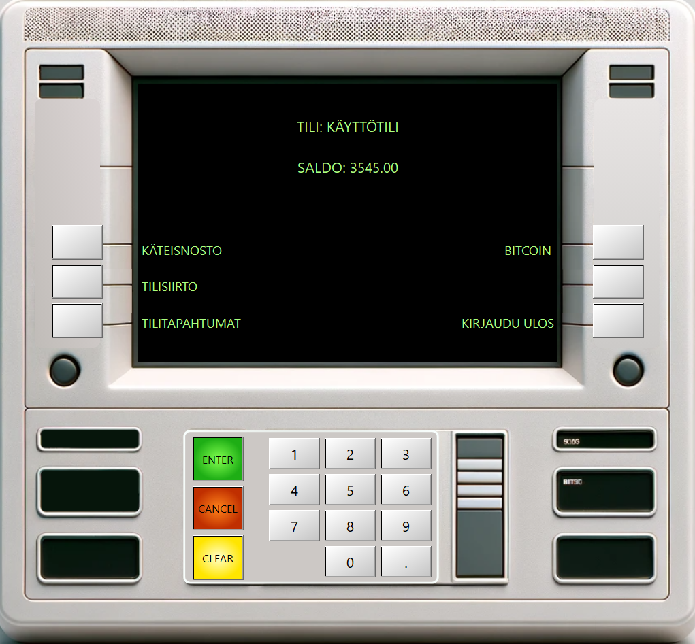
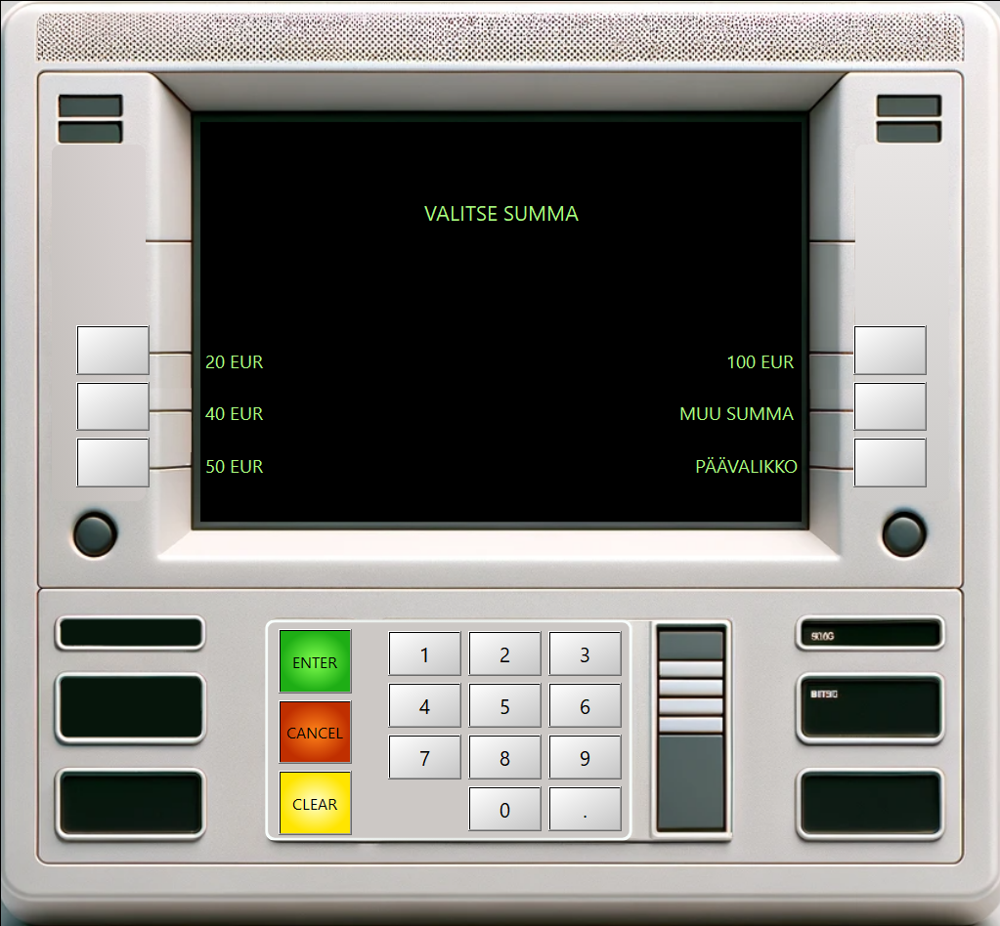
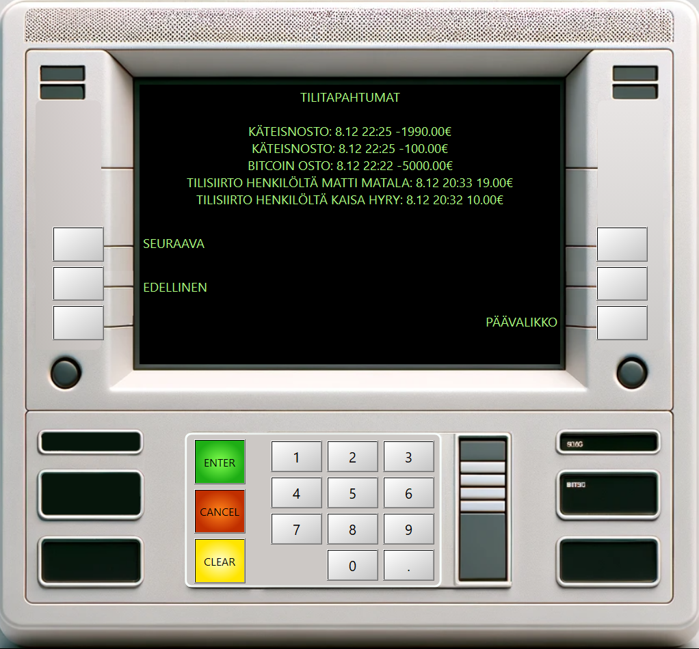

# Pankkiautomaattisimulaattori

## Ohjelmistokehityksen sovellusprojekti, Syksy 2023

## Tavoitteet
Toiminnallisena tavoitteena oli simuloida pankkiautomaatin toimintaa luomalla yksinkertainen työpöytäsovellus, joka mahdollistaa mm. käyttäjän tunnistamisen, saldotarkistuksen, käteisnoston, tilisiirron ja tilitapahtumien tarkastelun.

Oppimistavoitteina oli ohjelmistokehityksen eri vaiheisiin ja niiden dokumentaatioon tutustuminen, oliopohjaisen mallinnuskielen kaavioiden laatiminen ja tulkinta, graafisen sovelluksen ja tietokanta-arkkitehtuurin suunnittelu ja toteutus, sekä versionhallintatyökalun käyttö ryhmätyöprojektissa.

## Toteutus
Tietokanta toteutettiin MySQL-tietokantaohjelmistolla. REST API/palvelin rakennettiin käyttämällä Node.js -ympäristöä ja Express.js -sovelluskehystä. Tietokannan ja palvelimen väliseen kommunikaatioon käytettiin mysql2 -moduulia.

Käyttöliittymä ja työpöytäsovellus toteutettiin C++ -kielellä Qt Creator -kehitysympäristössä hyödyntäen Qt:n laajaa luokkakirjastoa.

Projektin loppuvaiheessa tietokantaan lisättiin mahdollisuus "Bitcoin-lompakon" avaamiseen. REST API:n puolelle lisättiin tarvittavat toiminnot reaaliaikaisen Bitcoin-kurssin hakemiseksi kolmannen osapuolen avoimesta rajapinnasta. Sovellukseen toteutettiin toiminnot Bitcoinin ostamista ja tilitapahtumien tarkastelua varten.

## Ryhmätyöskentely
Projektin aikana jokainen ryhmän jäsen pääsi suunnittelemaan ja kehittämään jokaista ohjelmistokomponenttia (tietokanta, REST API, käyttöliittymä). Itse vastasin pääasiassa käyttöliittymän ulkoasun suunnittelusta ja käteisnostotoiminnon vaatimien komponenttien toteutuksesta.

## Tietokannan rakenne

## UI kuvia

### Aloituskäyttöliittymä

### Päävalikko

### Käteisnosto

### Tilitapahtumat

### Bitcoin

